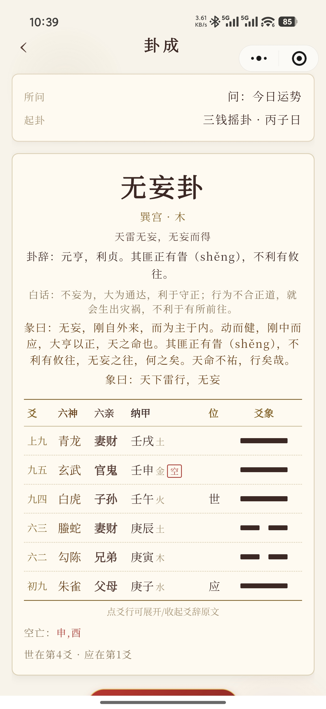
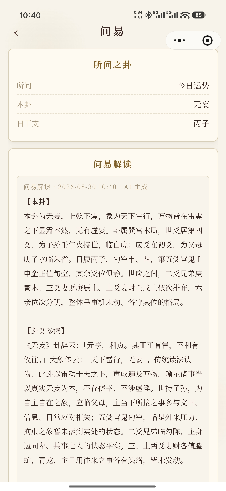
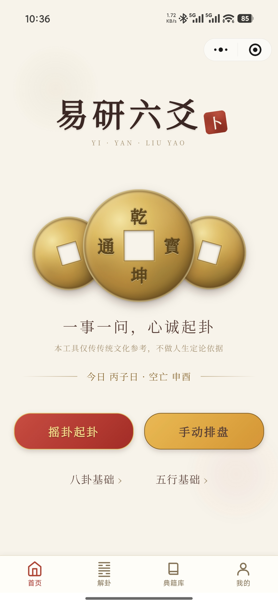
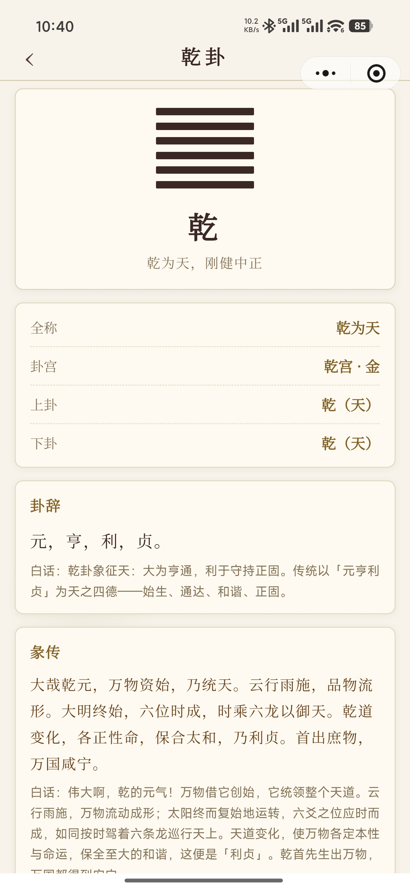
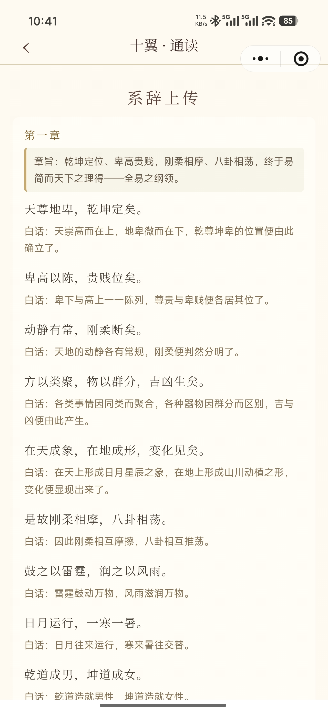
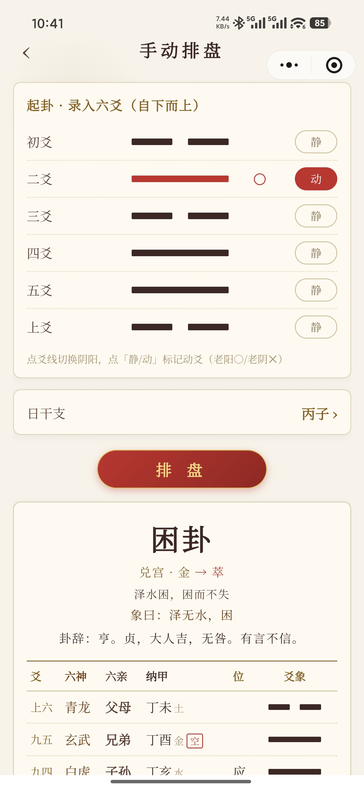

# 易研六爻 · 微信小程序

传统六爻（火珠林/金钱卦）传统文化学习小程序。**唯一产品线**：3D 龟壳摇铜钱起卦（分包 `package3d`）为主打入口，辅以手动排盘；解卦走「问易」——进页自动起问的单篇合参解读，v0.4.0 起由云端大模型（豆包 · 火山方舟）经微信云函数中转生成，密钥不出云端；云端不可用自动降级本地合成，体验不断线。

- 当前版本：**v0.4.1**（内容校对轮 · tag `v0.4.1` · 2026-08-28）
- 质量基线：**132/132** 断言全绿（wenyi 84 / liuyao 35 / gua 13），包全域审核红线词 0 命中
- 引擎口径：火珠林标准——纳甲 / 八宫世应（京房变卦法程序化生成）/ 六亲 / 六神 / 旬空 / 变卦
- 开源协议：**CC BY-NC 4.0**（署名-非商业性使用，商用需另行授权）

> 2026-08 整理：已删除伏羲 Streamlit 应用与其小程序移植版（CHAT），只保留本线。
> 有用的知识已收进 `tools/reference/`（64 卦 desc/大象传、参考页原型、`zhouyi.txt` 原文）。

## 功能一览

| 模块 | 说明 |
| --- | --- |
| 3D 三钱起卦 | 问事签（凝神默祷）→ 3D 龟壳摇铜钱（three.js，引擎独立分包异步注入）→ 卦成页 |
| 手动排盘 | 6 爻阴阳 + 动爻 + 日干支录入 → 完整卦盘，与摇卦同引擎同观感 |
| 卦成页 | 本卦/变卦并排、逐爻展开爻辞·小象·白话、旬空标注、宣纸风分享卡 |
| 问易（AI 解读） | 进页自动起问；云端生成【本卦】【动爻】【变卦】【合参】四段文（静卦三段）；解读落库可回看 |
| 典籍库 | 64 卦全文（卦辞/爻辞/用九用六，源自《周易》原文）+ 大象传 + 彖传/小象 + 说卦取象 + 典故 |
| 十翼通读 | 系辞上下/文言/说卦/序卦/杂卦全书逐句「原文（含拼音括注）/ 白话」对照 |
| 知识页 | 五行生克 / 八卦取象 / 八宫六十四卦表 |
| 体验 | 宣纸米黄 + 墨色双主题、楷体正文、字号三档、BGM 预留接口、历史记录（摇卦与排盘同库） |

## 运行预览（真机截图）

| 3D 龟壳摇卦 | 卦成 · 排盘 | 问易 · AI 解读 |
| --- | --- | --- |
|  |  |  |

| 首页 | 典籍库 · 卦详情 | 十翼通读 | 手动排盘 |
| --- | --- | --- | --- |
|  |  |  |  |

## 问易（AI 解卦）

三态开关 `utils/wenyi-config.js`（唯一改动点）：`''` 未开通 / `'mock'` 本地合成（零联网，降级层）/ `'cloud'` 云函数（**v0.4.0 起默认**）。

**云端链路**：

```text
摇卦卦成 → 问易页（onLoad 自动起问）→ wx.cloud.callFunction('wenyi')
  → 云函数：服务端复核排盘 → 提示词组装 → msgSecCheck 入口检
  → 豆包·火山方舟（OpenAI 兼容，思考模式默认关）
  → 七禁词扫描（命中一次纠偏重试）→ msgSecCheck 出口检
  → 四段解读 → 端上落库，result 页按钮转「回看 · 问易」
```

**安全与合规**（提审红线设计）：

- 密钥只存云函数环境变量（`WENYI_BASE_URL` / `WENYI_API_KEY` / `WENYI_MODEL` / `WENYI_TIMEOUT_MS`，另有限流 `WENYI_DAILY_LIMIT` 与思考开关 `WENYI_THINKING_OFF`），绝不进小程序包，也不进 git（`local/` 双排除）；
- 服务端按 `yao/dong/gz` **独立复核排盘**——端上伪造的卦名/变卦名进不了提示词（防注入）；
- 审核红线七禁词端到端扫描：提示词声明 + 云函数输出扫描 + 命中一次纠偏重试；
- `security.msgSecCheck` 双检：入口 fail-open（平台抖动不误伤）、出口 fail-closed（明确风险拦截）；
- 解读页固定页脚「仅供传统文化学习参考 · 不构成任何决策依据」。

**降级与一事一占**：云端任一失败（errCode / 超时 / 无 text）自动切本地合成并在摘要行标注「本地合成（模拟）」；解读生成即落库挂靠历史条目，回看不重问、不重复计费——蒙卦辞「初筮告，再三渎」，一事一占。

**部署与联调**：云开发部署步骤与环境变量清单见 `docs/AI问易接入方案.md` §七（环境变量值务必整段粘贴——曾踩半截 `WENYI_BASE_URL` 入库致 `ENOTFOUND`，详见开发日志 76）；本地直连联调 `node tools/wenyi-local.mjs`（配置在 `local/`，勿入库）。

## 项目结构

```text
├── app.js / app.json / app.wxss   全局配置（自定义导航/TabBar，宣纸米黄+墨色双主题）
├── custom-tab-bar/                自定义底部 TabBar
├── pages/                         主包页（4 个 tab + 卦详情数据锚点）
│   ├── index/                     首页：摇卦起卦(3D) / 手动排盘 双入口 + 知识页入口
│   ├── paigua/                    解卦速查（用神/断法口径）
│   ├── dianji/ detail             典籍库 tab：64卦浏览 / 卦详情（全站卦库数据锚点）
│   └── mine/                      我的（历史/版本/音乐）
├── package3d/                     分包：3D 起卦链路 ★ 主打
│   ├── models/ audio/             shell.glb 龟壳模型（非 Draco）+ 摇卦音效
│   ├── utils/wenyi-mock.js        本地合成器（零随机零联网；云端降级层）
│   └── pages/ ask→divination→result→wenyi   问事 → 摇卦 → 卦成 → 问易解读
├── packageEngine/                 分包：three 引擎（divination 页 require.async 异步注入）
├── packageBooks/                  分包：通识与工具页（首页/典籍库 tab 预载）
│   ├── wuxing/ bagua/ bagong/     知识页：五行 / 八卦 / 八宫六十四卦表
│   ├── paipan/                    手动排盘：6爻+日干支 → 完整盘
│   ├── dianji/shiyi               十翼通读（系辞文言说序杂逐句对照）
│   └── settings/ utils/bgm.js     设置（字号三档/深色/背景音乐）
├── utils/
│   ├── liuyao.js                  ★ 六爻排盘引擎（纯算法零依赖）
│   ├── sharecard.js               分享卡绘制（导出即拆画布节点，防同层渲染雷）
│   ├── wenyi-config.js            问易三态开关（''/mock/cloud，唯一改动点）
│   └── *.test.mjs                 测试（wenyi 84 / liuyao 35 / gua 13，node 直跑）
├── data/                          机器生成勿手改：gua(64卦经文) shiyi(十翼) baihua* diangu
├── cloudfunctions/wenyi/          问易云函数（服务端复核+提示词 v1.1+豆包调用；key 只存环境变量）
├── local/                         本地联调配置与输出（git/包双排除，密钥所在）
├── tools/                         生成与校对脚本（含 wenyi-cloud 快照/wenyi-local 直连）+ reference/
└── docs/                          版本说明/开发日志/技术文档/规格与方案/回归清单/校对档
```

## 排盘引擎 `utils/liuyao.js`

按火珠林标准实现：纳甲 / 八宫世应（京房变卦法程序化生成）/ 六亲（五行生克）/ 六神（日起）/ 旬空 / 变卦，另有公历→日干支（JDN 公式）。
`data/gua.js` 由 `tools/gen-gua-data.mjs` 生成：卦名卦宫来自引擎，大象传/desc 来自 `tools/reference/fuxi-gua.json`，**卦辞/爻辞/用九用六来自《周易》原文 `tools/reference/zhouyi.txt`**（GB18030 已转 UTF-8；注意坎卦经文作「习坎」已特判）。改引擎或 gua 源后须 `node tools/gen-wenyi-cloud.mjs` 重生成云函数快照（自校验不过会拦）。

## 测试与质量

- `node utils/wenyi.test.mjs`（84）/ `node utils/liuyao.test.mjs`（35）/ `node utils/gua.test.mjs`（13）——node 直跑零依赖，改完即验；
- **包全域七禁词扫描**：按 packOptions 模拟实际上传包内容，审核红线词 0 命中才放行（内置 wenyi 测试）；
- 数据管线硬校验：卦辞 64 / 爻辞 384 / 用九用六 2 缺一即拒生成；十翼白话「章文拼接逐字全等」契约；
- 云函数 CJS 快照与 ESM 引擎一致性抽检（防两套引擎漂移）；本地合成器全域 fuzz 7680 例长度零越界（历史轮）。

## 运行

1. 微信开发者工具打开项目根目录 → 编译。主链路：首页 →「摇卦起卦」→ 摇卦 → 卦成 → 问易；
2. 问易云端态需先开通云开发并部署 `cloudfunctions/wenyi`（步骤与环境变量清单：`docs/AI问易接入方案.md` §七）；不部署则把 `WENYI_MODE` 切回 `'mock'` 亦可全流程体验；
3. 改引擎或 gua 数据源后：`node tools/gen-gua-data.mjs` 重生成数据 + `node tools/gen-wenyi-cloud.mjs` 重生成云函数快照。

## 打包与密钥安全

`project.config.json` 的 `packOptions.ignore` 已忽略 `tools/`、`docs/`、`cloudfunctions/`、`local/`、`.mypy_cache/`、全部 `*.md` 与 `*.test.mjs`——新增文档/脚本/密钥类文件请放这些位置；**密钥只进 `local/`（本地）或云函数环境变量（线上），绝不进小程序包**。

## 版本速览

| 版本 | 日期 | 定位 |
| --- | --- | --- |
| v0.4.1 | 2026-08-28 | 卦爻辞白话外审闭环（原稿为基择优吸收 6 条） |
| v0.4.0 | 2026-08-27 | 云端切换：豆包经云函数上线 + 成卦页触摸双根因修复 + 问易自动起问 |
| v0.3.25 | 2026-08-27 | 测试版（mock 态）：提示词 v1.1 + 解后终局（一事一占） |
| v0.3.24 | 2026-08-27 | AI 问易奠基：本地合成模拟层 + 云函数脚手架 + 严格提示词 v1 |
| v0.3.23 | 2026-08-27 | 典籍库校对全闭环（内容修订收官轮） |
| v0.3.22 | 2026-08-27 | 十翼通读补齐文言/序/杂，全书白话对照闭环 |

逐版明细：[docs/版本说明.md](docs/版本说明.md) · 实况细账：[docs/开发日志.md](docs/开发日志.md)

## 开源协议

本仓库以 [CC BY-NC 4.0](LICENSE)（署名-非商业性使用 4.0 国际）发布：

- **可**：个人学习、研究、复制、分发、修改——须保留版权与许可声明、注明出处；
- **不可**：任何商业用途（商用 App/商业服务集成、售卖等）——需另行获得书面授权；
- 《周易》经文原文属公有领域；本仓白话翻译层、排盘引擎与 3D 实现按上述协议共享。
